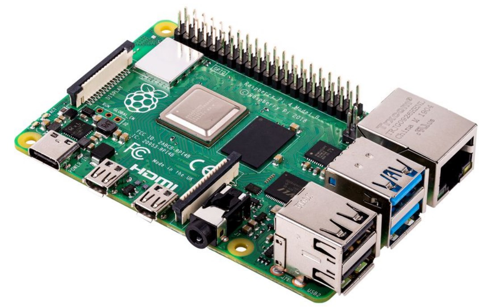
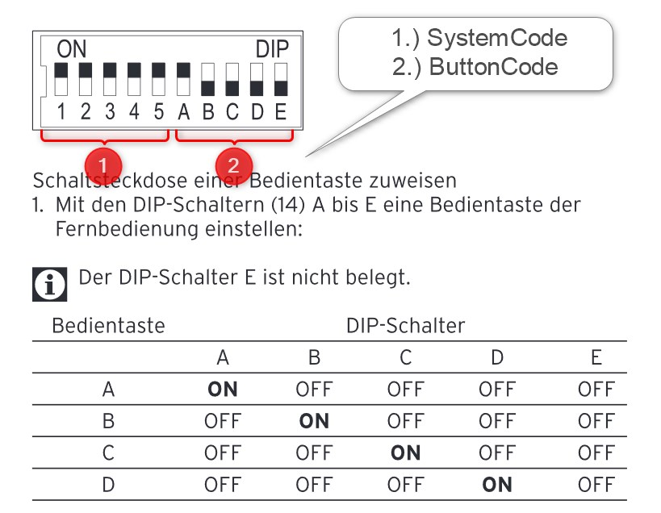
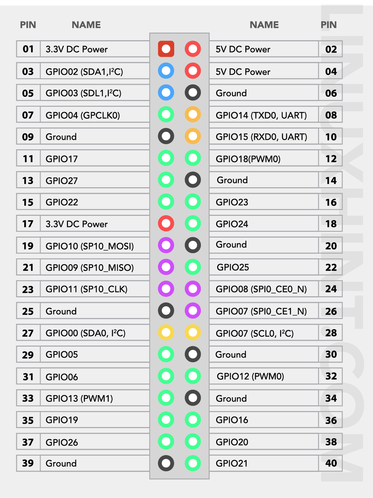

# rcSwitch-python

rcSwitch-python is a python based script to switch remote controlled sockets via 433 MHz.

This script is based on the following libraries:
- rpi-rf
- RPI.GPPIO

## Necessary Hardware
- Raspberry Pi or any other board having digital GPIO</br>


- 433 MHz transmitter (for sending -> send device)</br>


- 433 MHz controlled power socket, e.g. Brennenstuhl RCS 1000 N</br>


---
## Setting up the Hardware
- Connect the `VCC-Pin` of the 433 MHz transmitter to any 5 V output pin of your board.</br>
- The `GND-Pin` to a ground pin.</br>
- And the `ATAD-Pin` to any `GPIO` pin.</br>
In this example, GPIO 17 is used.

It is recommened to connect a (long) cable to the ANT pin of the 433 Mhz transmitter - this extends the range of the sender.

### Setup the Socket Device
To define the relevant Codes you have to set the dip switches in the socket.
See picture below:</br>


---
## Installation
### 1.) Installation of this Library
>Lets assume you want to install the library in the following path on you Pi:</br>/usr/local/bin/python/rcSwitch-python

To install this library there you need to run the following commands:

Create the dir `python`:
```
cd /usr/local/bin
sudo mkdir python
cd python
```
Then install  the library:

```
git clone https://github.com/hasenradball/rcSwitch-python.git
git checkout develop
```
---
### 2.) Installation of dependencies
Make sure that you have the latest packages on the Pi.

Do an update:
```
sudo apt update
sudo apt upgrade
```
Also make sure that you have installed the `rpi-rf` library.

```
python3 -m pip install rpi-rf
```
Optional:

- to be sure that the library is also available for `root` user, do this:

``` 
sudo -i
python3 -m pip install rpi-rf
exit
```
Then  you should make sure that the current `user` is in the `group` of the the `gpio` users.

```
sudo usermod -a -G gpio $USER
```
If you have dose this steps, then you should be able to switch the sockets now.

---
## Usage
To Switch the socket you can do this for example via `cli` like:

```
python3 switchSocket <SystemCode> <ButtonCode> <status>
```
This could look like this, if we assume the following codes:</br>
SystemCode = 10000, ButtonCode = 10000, status = 1

```
python3 ./switchSocket 10000 A 1
```
or this way:

```
python3 ./switchSocket 10000 16 1
```
or just like this way:

```
python3 ./switchSocket 10000 10000 1
```

Where the following correlations for the `ButtonCode` can be described:

|Letter|int|binary|
|------|---|------|
| A / a| 16| 10000|
| B / b|  8| 01000|
| C / c|  4| 00100|
| D / d|  2| 00010|
| E / e|  1| 00001|


---
## Further informations
---
### Troubleshooting
If you get an Error like:</br>
>RuntimeError: No access to /dev/mem.  Try running as root!

The user does not belong to the Group of `gpio`.
Try to run with `sudo`.

---
### Rasperry Pi GPIO Pins
</br>


---
### Links
For discussions see:</br>
https://knx-user-forum.de/forum/supportforen/smarthome-py/39094-logic-und-howto-für-433mhz-steckdosen

---
## Changelog

### v0.1
* initial version
